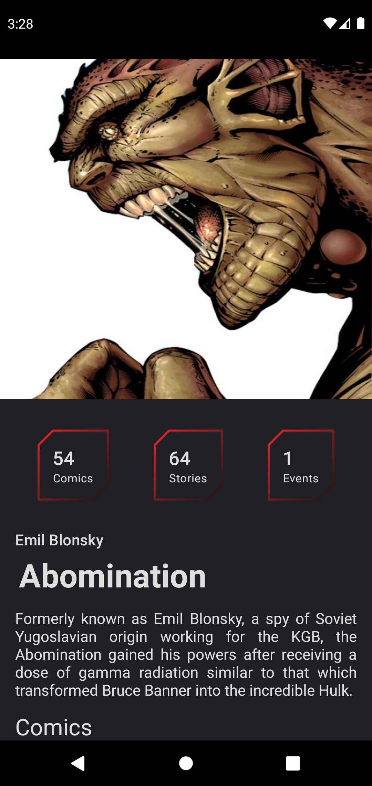

# Marvel Characters

Android Native App to list marvel characters from public [API](https://developer.marvel.com/docs "API"). Is a guide to introduce and practice software architecture concepts.

## What does App ?

The app take the characters of the marvel comics, through its public API and list them on screen. Also when clicking on a character it shows its detail.

## Architecture

**MVVM** is implemented with **clean architecture** concepts.

**Clean architecture layers**

**Project structure layers**

## Screenshots

|  List Characters | Detail Character   |
| :------------: | :------------: |
|  |  |
|  **Dark** | **Dark**  |
|  |  |